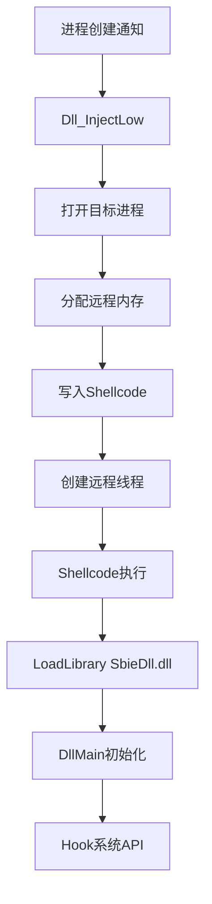
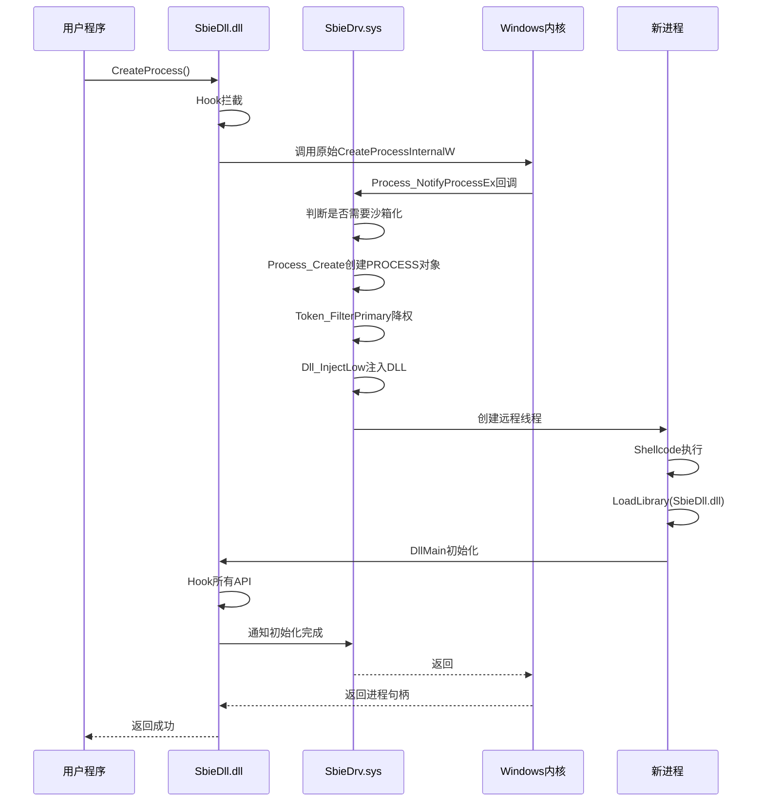

# Sandboxie 进程管理源码详解

## 概述

本文档深入分析 Sandboxie 的进程管理机制，包含详细的源码解析、数据结构定义和执行流程。

## 核心文件

- **驱动层**: `Sandboxie/core/drv/process.c` - 内核级进程管理
- **DLL层**: `Sandboxie/core/dll/proc.c` - 用户态进程Hook
- **服务层**: `Sandboxie/core/svc/ProcessServer.cpp` - 进程启动服务

---

## 一、驱动层进程管理 (process.c)

### 1.1 核心数据结构

#### PROCESS 结构体

```c
typedef struct _PROCESS {
    LIST_ELEM list_elem;              // 链表元素
    HANDLE pid;                       // 进程ID
    PEPROCESS eprocess;               // 内核进程对象指针
    BOX *box;                         // 所属沙箱
    WCHAR *image_name;                // 镜像名称
    ULONG image_name_len;             // 镜像名称长度
    
    // 进程标志
    BOOLEAN terminated;               // 是否已终止
    BOOLEAN sbiedll_loaded;           // SbieDll是否已加载
    BOOLEAN is_start_exe;             // 是否是Start.exe
    BOOLEAN disable_force_process;    // 禁用强制进程
    
    // 令牌相关
    void *primary_token;              // 主令牌
    void *restricted_token;           // 受限令牌
    
    // 时间戳
    LARGE_INTEGER create_time;        // 创建时间
    
    // 父进程
    HANDLE parent_pid;                // 父进程ID
    
    // 其他字段...
} PROCESS;
```

### 1.2 初始化流程

#### Process_Init() 函数

```c
_FX BOOLEAN Process_Init(void)
{
    NTSTATUS status = STATUS_UNSUCCESSFUL;

    // 1. 初始化进程哈希表
    map_init(&Process_Map, Driver_Pool);
    map_resize(&Process_Map, 128);  // 预分配128个桶

    // 2. 初始化锁资源
    if (! Mem_GetLockResource(&Process_ListLock, TRUE))
        return FALSE;

    // 3. 初始化底层注入
    if (! Process_Low_Init())
        return FALSE;

    // 4. 注册进程通知回调
    if (Driver_OsVersion >= DRIVER_WINDOWS_7) {
        // Windows 7+ 使用扩展版本
        status = PsSetCreateProcessNotifyRoutineEx(
            Process_NotifyProcessEx, FALSE);
    } else {
        // XP/Vista 使用旧版本
        status = PsSetCreateProcessNotifyRoutine(
            Process_NotifyProcess, FALSE);
    }

    if (NT_SUCCESS(status)) {
        Process_NotifyProcessInstalled = TRUE;
    } else {
        Log_Status(MSG_PROCESS_NOTIFY, 0x11, status);
        return FALSE;
    }

    // 5. 注册镜像加载通知
    status = PsSetLoadImageNotifyRoutine(Process_NotifyImage);
    if (NT_SUCCESS(status))
        Process_NotifyImageInstalled = TRUE;
    else {
        Log_Status(MSG_PROCESS_NOTIFY, 0x22, status);
        return FALSE;
    }

    // 6. 设置系统调用处理器
    if (! Syscall_Set1("CreateUserProcess", Process_CreateUserProcess))
        return FALSE;

    return TRUE;
}
```

**关键点**：
- 使用哈希表管理进程，提高查找效率
- 注册两个关键回调：进程创建/销毁、镜像加载
- 拦截 `NtCreateUserProcess` 系统调用

### 1.3 进程创建通知

#### Process_NotifyProcessEx() 回调

```c
static void Process_NotifyProcessEx(
    PEPROCESS ParentId, 
    HANDLE ProcessId, 
    PPS_CREATE_NOTIFY_INFO CreateInfo)
{
    KIRQL irql;
    PROCESS *proc;
    BOX *box;

    if (CreateInfo) {
        // ===== 进程创建 =====
        
        // 1. 确定进程应该在哪个沙箱中运行
        box = Process_GetForcedStartBox(
            ParentId, ProcessId, CreateInfo);
        
        if (box) {
            // 2. 创建 PROCESS 结构
            proc = Process_Create(
                ProcessId, box, 
                CreateInfo->ImageFileName->Buffer, 
                &irql);
            
            if (proc) {
                // 3. 设置进程令牌（降权）
                Token_FilterPrimary(proc, PsGetCurrentProcess());
                
                // 4. 注入 SbieDll.dll
                Dll_InjectLow(proc, CreateInfo);
                
                KeReleaseSpinLock(&Process_ListLock, irql);
            }
        }
        
    } else {
        // ===== 进程销毁 =====
        Process_NotifyProcess_Delete(ProcessId);
    }
}
```

**执行流程**：

```mermaid
sequenceDiagram
    participant Kernel as Windows内核
    participant Callback as Process_NotifyProcessEx
    participant Create as Process_Create
    participant Token as Token_FilterPrimary
    participant Inject as Dll_InjectLow

    Kernel->>Callback: 进程创建事件
    Callback->>Callback: 判断是否需要沙箱化
    Callback->>Create: 创建PROCESS结构
    Create-->>Callback: 返回proc对象
    Callback->>Token: 过滤进程令牌
    Token-->>Callback: 令牌降权完成
    Callback->>Inject: 注入SbieDll.dll
    Inject-->>Callback: 注入完成
    Callback-->>Kernel: 允许进程继续执行
```

### 1.4 进程对象创建

#### Process_Create() 函数

```c
static PROCESS *Process_Create(
    HANDLE ProcessId, 
    const BOX *box, 
    const WCHAR *image_path,
    KIRQL *out_irql)
{
    PROCESS *proc;
    NTSTATUS status;
    
    // 1. 分配内存
    proc = Mem_Alloc(Driver_Pool, sizeof(PROCESS));
    if (!proc)
        return NULL;
    
    memzero(proc, sizeof(PROCESS));
    
    // 2. 初始化基本字段
    proc->pid = ProcessId;
    proc->box = box;
    proc->create_time = KeQueryPerformanceCounter(NULL);
    
    // 3. 获取内核进程对象
    status = PsLookupProcessByProcessId(ProcessId, &proc->eprocess);
    if (!NT_SUCCESS(status)) {
        Mem_Free(proc, sizeof(PROCESS));
        return NULL;
    }
    
    // 4. 复制镜像路径
    proc->image_name_len = wcslen(image_path);
    proc->image_name = Mem_Alloc(
        Driver_Pool, 
        (proc->image_name_len + 1) * sizeof(WCHAR));
    wcscpy(proc->image_name, image_path);
    
    // 5. 初始化进程特定的路径列表
    File_InitPaths(proc);
    Key_InitPaths(proc);
    Ipc_InitPaths(proc);
    
    // 6. 加入哈希表
    KeAcquireSpinLock(&Process_ListLock, out_irql);
    map_insert(&Process_Map, ProcessId, proc, out_irql);
    
    return proc;
}
```

---

## 二、令牌管理 (token.c)

### 2.1 令牌过滤原理

Sandboxie 通过修改进程令牌来限制权限，核心函数是 `Token_FilterPrimary()`。

#### Token_FilterPrimary() 函数

```c
static void *Token_FilterPrimary(PROCESS *proc, void *ProcessObject)
{
    void *NewToken = NULL;
    void *OldToken;
    NTSTATUS status;
    
    // 1. 获取原始令牌
    OldToken = PsReferencePrimaryToken(ProcessObject);
    
    // 2. 创建受限令牌
    NewToken = Token_RestrictHelper1(OldToken, proc);
    
    if (NewToken) {
        // 3. 替换进程令牌
        status = Token_AssignPrimary(ProcessObject, NewToken, proc->box->session_id);
        
        if (NT_SUCCESS(status)) {
            // 4. 保存令牌引用
            proc->primary_token = NewToken;
            proc->restricted_token = NewToken;
        } else {
            ObDereferenceObject(NewToken);
            NewToken = NULL;
        }
    }
    
    ObDereferenceObject(OldToken);
    return NewToken;
}
```

#### Token_RestrictHelper3() - 实际过滤逻辑

```c
static void *Token_RestrictHelper3(
    void *TokenObject, 
    TOKEN_GROUPS *Groups, 
    TOKEN_PRIVILEGES *Privileges,
    PSID UserSid, 
    ULONG FilterFlags, 
    PROCESS *proc)
{
    void *NewToken = NULL;
    NTSTATUS status;
    
    // 1. 准备要禁用的SID列表
    TOKEN_GROUPS *SidsToDisable = NULL;
    if (Groups) {
        SidsToDisable = Mem_Alloc(Driver_Pool, ...);
        // 添加 Administrators、Power Users 等高权限组
        // 这些组将被标记为 SE_GROUP_USE_FOR_DENY_ONLY
    }
    
    // 2. 准备要删除的特权列表
    TOKEN_PRIVILEGES *PrivilegesToDelete = NULL;
    if (Privileges) {
        PrivilegesToDelete = Mem_Alloc(Driver_Pool, ...);
        // 删除危险特权如：
        // - SeDebugPrivilege (调试权限)
        // - SeLoadDriverPrivilege (加载驱动)
        // - SeTcbPrivilege (作为操作系统一部分)
        // 等等...
    }
    
    // 3. 准备受限SID列表
    TOKEN_GROUPS *RestrictedSids = NULL;
    // 添加 Sandboxie 自定义 SID (S-1-5-100-X)
    // 用于标识沙箱进程
    
    // 4. 调用内核函数创建过滤后的令牌
    status = Token_SepFilterToken(
        TokenObject,
        0,  // Flags
        SidsToDisable,
        PrivilegesToDelete,
        RestrictedSids,
        &NewToken
    );
    
    // 5. 清理临时内存
    if (SidsToDisable)
        Mem_Free(SidsToDisable, ...);
    if (PrivilegesToDelete)
        Mem_Free(PrivilegesToDelete, ...);
    if (RestrictedSids)
        Mem_Free(RestrictedSids, ...);
    
    return NT_SUCCESS(status) ? NewToken : NULL;
}
```

**令牌过滤效果**：

| 原始令牌 | 过滤后令牌 | 效果 |
|---------|-----------|------|
| Administrators 组 | USE_FOR_DENY_ONLY | 无法访问需要管理员权限的资源 |
| SeDebugPrivilege | 已删除 | 无法调试其他进程 |
| SeLoadDriverPrivilege | 已删除 | 无法加载内核驱动 |
| 添加 Sandboxie SID | S-1-5-100-X | 标识为沙箱进程 |

---

## 三、DLL 注入机制

### 3.1 注入时机

DLL 注入发生在进程创建的早期阶段，在 `Process_NotifyProcessEx` 回调中调用。

#### Dll_InjectLow() 函数（简化版）

```c
NTSTATUS Dll_InjectLow(PROCESS *proc, PPS_CREATE_NOTIFY_INFO CreateInfo)
{
    NTSTATUS status;
    HANDLE ProcessHandle;
    
    // 1. 打开目标进程
    status = ObOpenObjectByPointer(
        proc->eprocess,
        OBJ_KERNEL_HANDLE,
        NULL,
        PROCESS_ALL_ACCESS,
        *PsProcessType,
        KernelMode,
        &ProcessHandle
    );
    
    if (!NT_SUCCESS(status))
        return status;
    
    // 2. 在目标进程中分配内存
    PVOID RemoteMemory = NULL;
    SIZE_T MemorySize = 0x10000;  // 64KB
    
    status = ZwAllocateVirtualMemory(
        ProcessHandle,
        &RemoteMemory,
        0,
        &MemorySize,
        MEM_COMMIT | MEM_RESERVE,
        PAGE_EXECUTE_READWRITE
    );
    
    if (NT_SUCCESS(status)) {
        // 3. 写入注入代码（Shellcode）
        // 这段代码会加载 SbieDll.dll
        status = ZwWriteVirtualMemory(
            ProcessHandle,
            RemoteMemory,
            InjectionShellcode,
            ShellcodeSize,
            NULL
        );
        
        if (NT_SUCCESS(status)) {
            // 4. 创建远程线程执行注入代码
            HANDLE ThreadHandle;
            status = RtlCreateUserThread(
                ProcessHandle,
                NULL,
                FALSE,
                0,
                0,
                0,
                RemoteMemory,  // 线程入口点
                NULL,
                &ThreadHandle,
                NULL
            );
            
            if (NT_SUCCESS(status)) {
                ZwClose(ThreadHandle);
            }
        }
    }
    
    ZwClose(ProcessHandle);
    return status;
}
```

**注入流程图**：



### 3.2 Shellcode 结构

注入的 Shellcode 大致结构：

```asm
; 伪代码表示
shellcode:
    ; 1. 定位 kernel32.dll 基址
    call get_kernel32_base
    
    ; 2. 查找 LoadLibraryW 地址
    call find_function, "LoadLibraryW"
    
    ; 3. 加载 SbieDll.dll
    push offset dll_path      ; L"C:\\Program Files\\Sandboxie\\SbieDll.dll"
    call eax                  ; LoadLibraryW
    
    ; 4. 清理并返回
    ret

dll_path:
    dw "C:\\Program Files\\Sandboxie\\SbieDll.dll", 0
```

---

## 四、用户态进程管理 (proc.c)

### 4.1 进程创建Hook

#### Proc_CreateProcessInternalW() Hook

```c
BOOL Proc_CreateProcessInternalW(
    HANDLE hToken,
    LPCWSTR lpApplicationName,
    LPWSTR lpCommandLine,
    // ... 其他参数
    LPPROCESS_INFORMATION lpProcessInformation)
{
    BOOL result;
    WCHAR *normalized_path = NULL;
    
    // 1. 规范化应用程序路径
    if (lpApplicationName) {
        normalized_path = Proc_NormalizePath(lpApplicationName);
    }
    
    // 2. 检查是否允许启动
    if (!Proc_IsProcessAllowed(normalized_path)) {
        SetLastError(ERROR_ACCESS_DENIED);
        return FALSE;
    }
    
    // 3. 调用原始函数
    result = __sys_CreateProcessInternalW(
        hToken,
        lpApplicationName,
        lpCommandLine,
        // ... 其他参数
        lpProcessInformation
    );
    
    if (result) {
        // 4. 通知驱动新进程已创建
        SbieApi_Call(API_PROCESS_CREATED, 
                     lpProcessInformation->dwProcessId);
        
        // 5. 等待子进程完成初始化
        Proc_WaitForSbieDllInjection(
            lpProcessInformation->hProcess);
    }
    
    if (normalized_path)
        Dll_Free(normalized_path);
    
    return result;
}
```

---

## 五、完整的进程启动流程

### 5.1 时序图



### 5.2 关键检查点

1. **进程创建前** (用户态)
   - 检查程序是否在黑名单中
   - 验证路径合法性

2. **进程创建时** (内核态)
   - 确定沙箱归属
   - 创建 PROCESS 对象
   - 过滤令牌

3. **进程初始化** (内核态)
   - 注入 SbieDll.dll
   - 等待 DLL 加载完成

4. **DLL 初始化** (用户态)
   - Hook 所有关键 API
   - 建立与驱动的通信
   - 初始化路径映射

---

## 六、进程查询与管理

### 6.1 进程查找

#### Process_Find() 函数

```c
PROCESS *Process_Find(HANDLE ProcessId, KIRQL *out_irql)
{
    PROCESS *proc;
    
    // 1. 获取锁
    if (out_irql)
        KeAcquireSpinLock(&Process_ListLock, out_irql);
    else
        ExAcquireResourceSharedLite(Process_ListLock, TRUE);
    
    // 2. 从哈希表查找
    proc = map_get(&Process_Map, ProcessId);
    
    // 3. 验证进程是否有效
    if (proc && proc->terminated)
        proc = NULL;
    
    // 4. 如果不需要持有锁，释放它
    if (!out_irql) {
        ExReleaseResourceLite(Process_ListLock);
    }
    
    return proc;
}
```

### 6.2 进程销毁

#### Process_Delete() 函数

```c
static void Process_Delete(HANDLE ProcessId)
{
    KIRQL irql;
    PROCESS *proc;
    
    // 1. 查找并移除进程
    KeAcquireSpinLock(&Process_ListLock, &irql);
    proc = map_remove(&Process_Map, ProcessId);
    KeReleaseSpinLock(&Process_ListLock, irql);
    
    if (!proc)
        return;
    
    // 2. 标记为已终止
    proc->terminated = TRUE;
    
    // 3. 清理资源
    if (proc->primary_token) {
        ObDereferenceObject(proc->primary_token);
        proc->primary_token = NULL;
    }
    
    if (proc->eprocess) {
        ObDereferenceObject(proc->eprocess);
        proc->eprocess = NULL;
    }
    
    // 4. 清理路径列表
    File_FreePaths(proc);
    Key_FreePaths(proc);
    Ipc_FreePaths(proc);
    
    // 5. 释放内存
    if (proc->image_name)
        Mem_Free(proc->image_name, ...);
    
    Mem_Free(proc, sizeof(PROCESS));
}
```

---

## 七、性能优化

### 7.1 哈希表优化

```c
// 初始化时预分配桶
map_resize(&Process_Map, 128);

// 查找时间复杂度: O(1) 平均情况
// 相比链表的 O(n)，大幅提升性能
```

### 7.2 锁优化

```c
// 使用自旋锁保护短临界区
KeAcquireSpinLock(&Process_ListLock, &irql);
// ... 快速操作 ...
KeReleaseSpinLock(&Process_ListLock, irql);

// 使用资源锁保护长临界区
ExAcquireResourceSharedLite(Process_ListLock, TRUE);
// ... 可能耗时的操作 ...
ExReleaseResourceLite(Process_ListLock);
```

---

## 八、调试技巧

### 8.1 WinDbg 调试命令

```
// 查看所有沙箱进程
!list -x "dt PROCESS" poi(Process_Map)

// 查看特定进程
dt PROCESS <address>

// 查看进程令牌
!token <token_address>

// 设置断点
bp SbieDrv!Process_NotifyProcessEx
bp SbieDrv!Process_Create
bp SbieDrv!Token_FilterPrimary
```

### 8.2 日志输出

```c
// 在代码中添加调试输出
DbgPrint("Sandboxie: Process %d created in box %S\n", 
         ProcessId, box->name);

// 使用 DebugView 查看输出
```

---

## 总结

Sandboxie 的进程管理机制通过以下关键技术实现：

1. **内核回调** - 监控所有进程创建/销毁事件
2. **令牌过滤** - 降低进程权限，限制访问能力
3. **DLL 注入** - 在用户态拦截 API 调用
4. **哈希表管理** - 高效管理进程对象
5. **多层协作** - 驱动层、DLL层、服务层紧密配合

这种设计确保了：
- ✅ 所有沙箱进程都被正确跟踪
- ✅ 权限被有效限制
- ✅ API 调用被完全拦截
- ✅ 性能开销最小化
