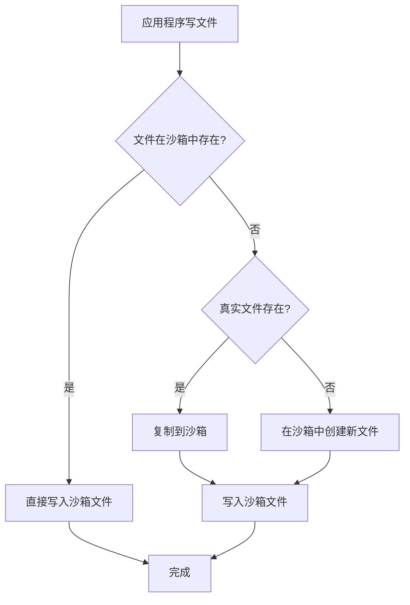

# Sandboxie 文件系统虚拟化源码详解

## 概述

文件系统虚拟化是 Sandboxie 最核心的功能之一，通过路径重定向和写时复制（Copy-on-Write）技术，实现文件隔离。

## 核心文件

- **驱动层**: `Sandboxie/core/drv/file.c` - 内核级文件过滤
- **DLL层**: `Sandboxie/core/dll/file.c` - 用户态文件Hook
- **过滤驱动**: `Sandboxie/core/drv/file_flt.c` - 文件系统过滤器

---

## 一、路径映射机制

### 1.1 路径结构

```
真实路径 (TruePath):
C:\Windows\System32\notepad.exe

沙箱路径 (CopyPath):
C:\Sandbox\DefaultBox\drive\C\Windows\System32\notepad.exe

映射关系:
TruePath → CopyPath (写操作时)
CopyPath → TruePath (读操作时，如果CopyPath不存在)
```

### 1.2 核心数据结构

#### FILE_DRIVE 结构

```c
typedef struct _FILE_DRIVE {
    LIST_ELEM list_elem;
    WCHAR letter;                    // 驱动器字母 (C, D, E...)
    WCHAR *path;                     // 真实路径
    ULONG path_len;                  // 路径长度
    WCHAR *sn;                       // 卷序列号
} FILE_DRIVE;
```

#### FILE_LINK 结构

```c
typedef struct _FILE_LINK {
    LIST_ELEM list_elem;
    WCHAR *src;                      // 源路径
    WCHAR *dst;                      // 目标路径
    ULONG src_len;
    ULONG dst_len;
} FILE_LINK;
```

---

## 二、驱动层文件拦截 (file.c)

### 2.1 初始化

#### File_Init() 函数

```c
_FX BOOLEAN File_Init(void)
{
    // 1. 根据操作系统版本选择拦截方式
    P_File_Init_2 p_File_Init_2 = File_Init_Filter;
    
#ifdef XP_SUPPORT
#ifndef _WIN64
    if (Driver_OsVersion < DRIVER_WINDOWS_VISTA) {
        // XP/2003 使用 Parse Procedure Hook
        p_File_Init_2 = File_Init_XpHook;
    }
#endif
#endif

    // 2. 安装文件系统过滤器或Hook
    if (! p_File_Init_2())
        return FALSE;

    // 3. 初始化重解析点
    File_InitReparsePoints(TRUE);

    // 4. 设置系统调用处理器
    if (! Syscall_Set1("CreateFile", File_NtCreateFile))
        return FALSE;
    if (! Syscall_Set1("OpenFile", File_NtOpenFile))
        return FALSE;

    return TRUE;
}
```

### 2.2 文件创建拦截

#### File_NtCreateFile() 系统调用处理

```c
NTSTATUS File_NtCreateFile(
    PROCESS *proc, 
    SYSCALL_ENTRY *syscall_entry, 
    ULONG_PTR *user_args)
{
    HANDLE *FileHandle = (HANDLE *)user_args[0];
    ACCESS_MASK DesiredAccess = (ACCESS_MASK)user_args[1];
    OBJECT_ATTRIBUTES *ObjectAttributes = (OBJECT_ATTRIBUTES *)user_args[2];
    // ... 其他参数

    NTSTATUS status;
    WCHAR *TruePath = NULL;
    WCHAR *CopyPath = NULL;
    ULONG FileFlags = 0;

    // 1. 解析文件路径
    status = File_GetName(
        ObjectAttributes->RootDirectory,
        ObjectAttributes->ObjectName,
        &TruePath,
        &CopyPath,
        &FileFlags
    );

    if (!NT_SUCCESS(status))
        return status;

    // 2. 检查访问权限
    ULONG MatchFlags = File_MatchPath(TruePath, &FileFlags);

    if (MatchFlags & FILE_CLOSED_FLAG) {
        // 路径被完全阻止
        status = STATUS_ACCESS_DENIED;
        goto cleanup;
    }

    // 3. 判断是读还是写操作
    BOOLEAN IsWriteAccess = (DesiredAccess & FILE_WRITE_ACCESS) != 0;

    if (IsWriteAccess || (MatchFlags & FILE_WRITE_FLAG)) {
        // 写操作 - 重定向到沙箱路径
        status = File_CreateCopyFile(
            FileHandle,
            DesiredAccess,
            ObjectAttributes,
            // ... 其他参数
            TruePath,
            CopyPath
        );
    } else {
        // 读操作 - 尝试从沙箱读取，失败则从真实路径读取
        status = File_OpenForRead(
            FileHandle,
            DesiredAccess,
            ObjectAttributes,
            TruePath,
            CopyPath
        );
    }

cleanup:
    if (TruePath)
        Mem_Free(TruePath, ...);
    if (CopyPath)
        Mem_Free(CopyPath, ...);

    return status;
}
```

### 2.3 路径解析

#### File_GetName() 函数

```c
NTSTATUS File_GetName(
    HANDLE RootDirectory,
    UNICODE_STRING *ObjectName,
    WCHAR **OutTruePath,
    WCHAR **OutCopyPath,
    ULONG *OutFlags)
{
    WCHAR *path = NULL;
    ULONG path_len = 0;
    NTSTATUS status;

    // 1. 处理根目录句柄
    if (RootDirectory) {
        // 从句柄获取路径
        status = File_GetPathFromHandle(RootDirectory, &path, &path_len);
        if (!NT_SUCCESS(status))
            return status;
    }

    // 2. 拼接对象名称
    if (ObjectName && ObjectName->Length) {
        ULONG new_len = path_len + ObjectName->Length / sizeof(WCHAR) + 1;
        WCHAR *new_path = Mem_Alloc(Driver_Pool, new_len * sizeof(WCHAR));
        
        if (path) {
            wcscpy(new_path, path);
            Mem_Free(path, ...);
        }
        wcscat(new_path, ObjectName->Buffer);
        
        path = new_path;
        path_len = new_len;
    }

    // 3. 规范化路径
    File_NormalizePath(path, path_len);

    // 4. 生成沙箱路径
    *OutTruePath = path;
    *OutCopyPath = File_TranslateTruePathToCopyPath(path);

    return STATUS_SUCCESS;
}
```

#### File_TranslateTruePathToCopyPath() 函数

```c
WCHAR *File_TranslateTruePathToCopyPath(const WCHAR *TruePath)
{
    WCHAR *CopyPath;
    ULONG true_len = wcslen(TruePath);
    ULONG copy_len;

    // 计算沙箱路径长度
    // 格式: BoxFilePath + "\drive\" + 驱动器字母 + 剩余路径
    // 例如: C:\Sandbox\DefaultBox\drive\C\Windows\...
    
    copy_len = Dll_BoxFilePathLen +  // C:\Sandbox\DefaultBox
               6 +                     // \drive
               true_len;               // \C\Windows\...

    CopyPath = Mem_Alloc(Driver_Pool, (copy_len + 1) * sizeof(WCHAR));

    // 构建路径
    wcscpy(CopyPath, Dll_BoxFilePath);
    wcscat(CopyPath, L"\\drive");
    
    // 添加驱动器字母
    if (TruePath[0] && TruePath[1] == L':') {
        wcscat(CopyPath, L"\\");
        wcsncat(CopyPath, TruePath, 1);  // 只添加驱动器字母
        wcscat(CopyPath, TruePath + 2);  // 添加剩余路径
    } else {
        wcscat(CopyPath, TruePath);
    }

    return CopyPath;
}
```

---

## 三、写时复制 (Copy-on-Write)

### 3.1 原理



### 3.2 实现

#### File_CreateCopyFile() 函数

```c
NTSTATUS File_CreateCopyFile(
    HANDLE *FileHandle,
    ACCESS_MASK DesiredAccess,
    OBJECT_ATTRIBUTES *ObjectAttributes,
    // ... 其他参数
    const WCHAR *TruePath,
    const WCHAR *CopyPath)
{
    NTSTATUS status;
    BOOLEAN file_exists_in_sandbox = FALSE;
    BOOLEAN file_exists_in_true = FALSE;

    // 1. 检查沙箱中是否已存在
    status = File_CheckFileExists(CopyPath);
    if (NT_SUCCESS(status)) {
        file_exists_in_sandbox = TRUE;
    }

    // 2. 如果沙箱中不存在，检查真实路径
    if (!file_exists_in_sandbox) {
        status = File_CheckFileExists(TruePath);
        if (NT_SUCCESS(status)) {
            file_exists_in_true = TRUE;
        }
    }

    // 3. 执行写时复制
    if (!file_exists_in_sandbox && file_exists_in_true) {
        // 需要复制文件
        status = File_MigrateFile(TruePath, CopyPath, TRUE, TRUE);
        if (!NT_SUCCESS(status))
            return status;
    }

    // 4. 确保父目录存在
    if (!file_exists_in_sandbox) {
        status = File_CreatePath(TruePath, CopyPath);
        if (!NT_SUCCESS(status))
            return status;
    }

    // 5. 在沙箱路径中创建/打开文件
    OBJECT_ATTRIBUTES copy_objattrs;
    UNICODE_STRING copy_name;
    
    RtlInitUnicodeString(&copy_name, CopyPath);
    InitializeObjectAttributes(
        &copy_objattrs,
        &copy_name,
        ObjectAttributes->Attributes,
        NULL,
        ObjectAttributes->SecurityDescriptor
    );

    status = ZwCreateFile(
        FileHandle,
        DesiredAccess,
        &copy_objattrs,
        // ... 其他参数
    );

    return status;
}
```

#### File_MigrateFile() - 文件迁移

```c
NTSTATUS File_MigrateFile(
    const WCHAR *TruePath,
    const WCHAR *CopyPath,
    BOOLEAN IsWritePath,
    BOOLEAN WithContents)
{
    NTSTATUS status;
    HANDLE src_handle = NULL;
    HANDLE dst_handle = NULL;
    IO_STATUS_BLOCK io_status;

    // 1. 打开源文件（真实路径）
    OBJECT_ATTRIBUTES src_objattrs;
    UNICODE_STRING src_name;
    RtlInitUnicodeString(&src_name, TruePath);
    InitializeObjectAttributes(&src_objattrs, &src_name, ...);

    status = ZwOpenFile(
        &src_handle,
        FILE_READ_DATA | FILE_READ_ATTRIBUTES,
        &src_objattrs,
        &io_status,
        FILE_SHARE_READ,
        0
    );

    if (!NT_SUCCESS(status))
        return status;

    // 2. 获取文件属性
    FILE_BASIC_INFORMATION basic_info;
    status = ZwQueryInformationFile(
        src_handle,
        &io_status,
        &basic_info,
        sizeof(basic_info),
        FileBasicInformation
    );

    // 3. 创建目标文件（沙箱路径）
    OBJECT_ATTRIBUTES dst_objattrs;
    UNICODE_STRING dst_name;
    RtlInitUnicodeString(&dst_name, CopyPath);
    InitializeObjectAttributes(&dst_objattrs, &dst_name, ...);

    status = ZwCreateFile(
        &dst_handle,
        FILE_WRITE_DATA | FILE_WRITE_ATTRIBUTES,
        &dst_objattrs,
        &io_status,
        NULL,
        basic_info.FileAttributes,
        0,
        FILE_CREATE,
        FILE_SYNCHRONOUS_IO_NONALERT,
        NULL,
        0
    );

    if (!NT_SUCCESS(status))
        goto cleanup;

    // 4. 复制文件内容（如果需要）
    if (WithContents) {
        UCHAR buffer[65536];  // 64KB 缓冲区
        LARGE_INTEGER offset = {0};

        while (TRUE) {
            // 读取源文件
            status = ZwReadFile(
                src_handle,
                NULL,
                NULL,
                NULL,
                &io_status,
                buffer,
                sizeof(buffer),
                &offset,
                NULL
            );

            if (status == STATUS_END_OF_FILE)
                break;

            if (!NT_SUCCESS(status))
                goto cleanup;

            // 写入目标文件
            status = ZwWriteFile(
                dst_handle,
                NULL,
                NULL,
                NULL,
                &io_status,
                buffer,
                (ULONG)io_status.Information,
                &offset,
                NULL
            );

            if (!NT_SUCCESS(status))
                goto cleanup;

            offset.QuadPart += io_status.Information;
        }
    }

    // 5. 复制文件时间戳
    status = ZwSetInformationFile(
        dst_handle,
        &io_status,
        &basic_info,
        sizeof(basic_info),
        FileBasicInformation
    );

cleanup:
    if (src_handle)
        ZwClose(src_handle);
    if (dst_handle)
        ZwClose(dst_handle);

    return status;
}
```

---

## 四、用户态文件Hook (dll/file.c)

### 4.1 Hook 安装

#### File_Init() - DLL层初始化

```c
BOOLEAN File_Init(void)
{
    // 1. Hook NtCreateFile
    SBIEDLL_HOOK(File_NtCreateFile);
    
    // 2. Hook NtOpenFile
    SBIEDLL_HOOK(File_NtOpenFile);
    
    // 3. Hook NtQueryAttributesFile
    SBIEDLL_HOOK(File_NtQueryAttributesFile);
    
    // 4. Hook NtQueryDirectoryFile
    SBIEDLL_HOOK(File_NtQueryDirectoryFile);
    
    // 5. Hook NtSetInformationFile
    SBIEDLL_HOOK(File_NtSetInformationFile);
    
    // 6. Hook NtDeleteFile
    SBIEDLL_HOOK(File_NtDeleteFile);
    
    return TRUE;
}
```

### 4.2 文件创建Hook

#### File_NtCreateFile() - DLL层

```c
NTSTATUS File_NtCreateFile(
    HANDLE *FileHandle,
    ACCESS_MASK DesiredAccess,
    OBJECT_ATTRIBUTES *ObjectAttributes,
    IO_STATUS_BLOCK *IoStatusBlock,
    LARGE_INTEGER *AllocationSize,
    ULONG FileAttributes,
    ULONG ShareAccess,
    ULONG CreateDisposition,
    ULONG CreateOptions,
    void *EaBuffer,
    ULONG EaLength)
{
    NTSTATUS status;
    WCHAR *TruePath = NULL;
    WCHAR *CopyPath = NULL;
    ULONG Flags = 0;

    // 1. 获取路径
    status = File_GetName(
        ObjectAttributes->RootDirectory,
        ObjectAttributes->ObjectName,
        &TruePath,
        &CopyPath,
        &Flags
    );

    if (!NT_SUCCESS(status))
        return __sys_NtCreateFile(...);  // 调用原始函数

    // 2. 检查是否需要重定向
    if (Flags & FGN_IS_BOXED_PATH) {
        // 已经是沙箱路径，直接调用
        status = __sys_NtCreateFile(...);
    } else {
        // 需要重定向到沙箱
        OBJECT_ATTRIBUTES copy_objattrs;
        UNICODE_STRING copy_name;
        
        RtlInitUnicodeString(&copy_name, CopyPath);
        InitializeObjectAttributes(
            &copy_objattrs,
            &copy_name,
            ObjectAttributes->Attributes,
            NULL,
            ObjectAttributes->SecurityDescriptor
        );

        // 调用驱动层处理
        status = __sys_NtCreateFile(
            FileHandle,
            DesiredAccess,
            &copy_objattrs,  // 使用沙箱路径
            IoStatusBlock,
            AllocationSize,
            FileAttributes,
            ShareAccess,
            CreateDisposition,
            CreateOptions,
            EaBuffer,
            EaLength
        );
    }

    // 3. 清理
    if (TruePath)
        Dll_Free(TruePath);
    if (CopyPath)
        Dll_Free(CopyPath);

    return status;
}
```

---

## 五、路径匹配规则

### 5.1 配置项

在 `Sandboxie.ini` 中配置：

```ini
[DefaultBox]
; 开放路径 - 直接访问，不重定向
OpenFilePath=C:\Windows\Fonts
OpenFilePath=C:\Windows\System32\drivers\etc\hosts

; 关闭路径 - 完全阻止访问
ClosedFilePath=C:\Windows\System32\config

; 只读路径 - 允许读，写时重定向
ReadFilePath=C:\Program Files

; 写路径 - 总是重定向
WriteFilePath=C:\Users\%USER%\Documents
```

### 5.2 匹配算法

#### File_MatchPath() 函数

```c
ULONG File_MatchPath(const WCHAR *path, ULONG *FileFlags)
{
    ULONG result = 0;
    
    // 1. 检查 ClosedFilePath
    if (File_MatchPathList(path, &Closed_File_Paths)) {
        result |= FILE_CLOSED_FLAG;
        return result;  // 立即返回，阻止访问
    }
    
    // 2. 检查 OpenFilePath
    if (File_MatchPathList(path, &Open_File_Paths)) {
        result |= FILE_OPEN_FLAG;
        return result;  // 直接访问，不重定向
    }
    
    // 3. 检查 ReadFilePath
    if (File_MatchPathList(path, &Read_File_Paths)) {
        result |= FILE_READ_FLAG;
    }
    
    // 4. 检查 WriteFilePath
    if (File_MatchPathList(path, &Write_File_Paths)) {
        result |= FILE_WRITE_FLAG;
    }
    
    // 5. 默认行为：写时重定向
    if (result == 0) {
        result |= FILE_WRITE_FLAG;
    }
    
    return result;
}
```

---

## 六、文件系统过滤器 (file_flt.c)

### 6.1 过滤器注册

#### File_Init_Filter() 函数

```c
BOOLEAN File_Init_Filter(void)
{
    NTSTATUS status;
    
    // 1. 注册过滤器
    status = FltRegisterFilter(
        Driver_Object,
        &File_FilterRegistration,
        &File_FilterHandle
    );
    
    if (!NT_SUCCESS(status))
        return FALSE;
    
    // 2. 启动过滤
    status = FltStartFiltering(File_FilterHandle);
    
    if (!NT_SUCCESS(status)) {
        FltUnregisterFilter(File_FilterHandle);
        return FALSE;
    }
    
    return TRUE;
}
```

### 6.2 过滤器回调

```c
FLT_REGISTRATION File_FilterRegistration = {
    sizeof(FLT_REGISTRATION),
    FLT_REGISTRATION_VERSION,
    0,                                  // Flags
    NULL,                               // Context
    File_FilterCallbacks,               // 回调数组
    File_FilterUnload,                  // 卸载回调
    NULL,                               // InstanceSetup
    NULL,                               // InstanceQueryTeardown
    NULL,                               // InstanceTeardownStart
    NULL,                               // InstanceTeardownComplete
    NULL, NULL, NULL                    // 其他回调
};

const FLT_OPERATION_REGISTRATION File_FilterCallbacks[] = {
    {
        IRP_MJ_CREATE,
        0,
        File_PreCreate,
        File_PostCreate
    },
    {
        IRP_MJ_WRITE,
        0,
        File_PreWrite,
        File_PostWrite
    },
    {
        IRP_MJ_SET_INFORMATION,
        0,
        File_PreSetInformation,
        File_PostSetInformation
    },
    { IRP_MJ_OPERATION_END }
};
```

#### File_PreCreate() 回调

```c
FLT_PREOP_CALLBACK_STATUS File_PreCreate(
    PFLT_CALLBACK_DATA Data,
    PCFLT_RELATED_OBJECTS FltObjects,
    PVOID *CompletionContext)
{
    PROCESS *proc;
    NTSTATUS status;
    
    // 1. 获取进程对象
    proc = Process_Find(PsGetCurrentProcessId(), NULL);
    if (!proc)
        return FLT_PREOP_SUCCESS_NO_CALLBACK;  // 不是沙箱进程
    
    // 2. 获取文件路径
    WCHAR *path = NULL;
    status = File_GetPathFromFileObject(
        Data->Iopb->TargetFileObject,
        &path
    );
    
    if (!NT_SUCCESS(status))
        return FLT_PREOP_SUCCESS_NO_CALLBACK;
    
    // 3. 检查访问权限
    ULONG match_flags = File_MatchPath(path, NULL);
    
    if (match_flags & FILE_CLOSED_FLAG) {
        // 阻止访问
        Data->IoStatus.Status = STATUS_ACCESS_DENIED;
        Mem_Free(path, ...);
        return FLT_PREOP_COMPLETE;
    }
    
    // 4. 路径重定向
    if (!(match_flags & FILE_OPEN_FLAG)) {
        WCHAR *copy_path = File_TranslateTruePathToCopyPath(path);
        
        // 修改目标路径
        status = File_RedirectPath(Data, copy_path);
        
        Mem_Free(copy_path, ...);
    }
    
    Mem_Free(path, ...);
    return FLT_PREOP_SUCCESS_NO_CALLBACK;
}
```

---

## 七、性能优化

### 7.1 路径缓存

```c
// 缓存最近访问的路径映射
typedef struct _PATH_CACHE_ENTRY {
    WCHAR *true_path;
    WCHAR *copy_path;
    ULONG flags;
    LARGE_INTEGER timestamp;
} PATH_CACHE_ENTRY;

static PATH_CACHE_ENTRY Path_Cache[256];
static ULONG Path_Cache_Index = 0;

WCHAR *File_GetCachedCopyPath(const WCHAR *TruePath)
{
    // 查找缓存
    for (ULONG i = 0; i < 256; i++) {
        if (Path_Cache[i].true_path &&
            wcscmp(Path_Cache[i].true_path, TruePath) == 0) {
            return Path_Cache[i].copy_path;
        }
    }
    
    // 未命中，计算并缓存
    WCHAR *copy_path = File_TranslateTruePathToCopyPath(TruePath);
    
    // 添加到缓存
    ULONG index = Path_Cache_Index++ % 256;
    if (Path_Cache[index].true_path)
        Mem_Free(Path_Cache[index].true_path, ...);
    if (Path_Cache[index].copy_path)
        Mem_Free(Path_Cache[index].copy_path, ...);
    
    Path_Cache[index].true_path = Mem_AllocString(TruePath);
    Path_Cache[index].copy_path = copy_path;
    
    return copy_path;
}
```

### 7.2 批量操作优化

```c
// 目录枚举时，批量处理文件
NTSTATUS File_NtQueryDirectoryFile(
    HANDLE FileHandle,
    // ... 参数
)
{
    // 一次性读取多个文件信息，减少系统调用次数
    UCHAR buffer[32768];  // 32KB 缓冲区
    
    status = __sys_NtQueryDirectoryFile(
        FileHandle,
        NULL, NULL, NULL,
        &io_status,
        buffer,
        sizeof(buffer),  // 大缓冲区
        FileInformationClass,
        FALSE,  // ReturnSingleEntry = FALSE
        FileName,
        RestartScan
    );
    
    // 批量处理结果
    // ...
}
```

---

## 八、调试技巧

### 8.1 启用文件访问日志

在 `Sandboxie.ini` 中：

```ini
[DefaultBox]
FileTrace=*
```

### 8.2 WinDbg 断点

```
// 文件创建
bp SbieDrv!File_NtCreateFile

// 路径解析
bp SbieDrv!File_GetName

// 写时复制
bp SbieDrv!File_MigrateFile

// 查看路径
du poi(esp+8)  // TruePath
du poi(esp+c)  // CopyPath
```

### 8.3 Process Monitor 过滤

```
Process Name is <your_app.exe>
Operation is CreateFile
Path contains Sandbox
```

---

## 总结

Sandboxie 文件系统虚拟化通过以下技术实现：

1. **路径重定向** - 将文件操作重定向到沙箱目录
2. **写时复制** - 首次写入时才复制文件
3. **多层拦截** - 驱动层过滤器 + DLL层Hook
4. **灵活配置** - Open/Closed/Read/Write 路径规则
5. **性能优化** - 路径缓存、批量操作

这确保了：
- ✅ 文件完全隔离
- ✅ 透明重定向
- ✅ 最小性能开销
- ✅ 灵活的访问控制
