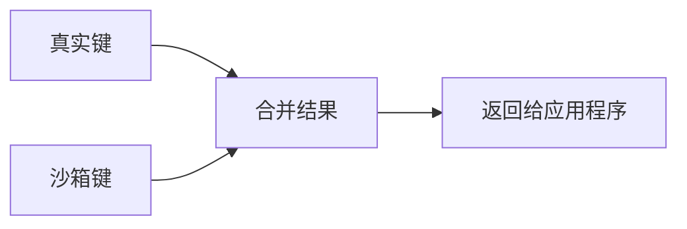

# Sandboxie 注册表虚拟化源码详解

## 概述

注册表虚拟化通过拦截注册表操作，将修改重定向到沙箱专用的注册表配置单元（Hive），实现注册表隔离。

## 核心文件

- **驱动层**: `Sandboxie/core/drv/key.c` - 内核级注册表过滤
- **DLL层**: `Sandboxie/core/dll/key.c` - 用户态注册表Hook
- **过滤器**: `Sandboxie/core/drv/key_flt.c` - 注册表过滤回调

---

## 一、注册表路径映射

### 1.1 路径结构

```
真实路径 (TruePath):
\REGISTRY\USER\S-1-5-21-xxx\Software\Microsoft\Windows

沙箱路径 (CopyPath):
\REGISTRY\USER\Sandbox_<SID>_DefaultBox\user\current\Software\Microsoft\Windows

映射关系:
HKEY_CURRENT_USER → \REGISTRY\USER\Sandbox_xxx\user\current
HKEY_LOCAL_MACHINE → \REGISTRY\MACHINE (部分键重定向)
```

### 1.2 核心数据结构

#### KEY_MOUNT 结构

```c
struct _KEY_MOUNT {
    LIST_ELEM list_elem;
    
    WCHAR *hive_path;           // Hive文件路径
    ULONG hive_path_len;
    
    WCHAR *root_key;            // 挂载点注册表路径
    ULONG root_key_len;
    
    volatile ULONG ref_count;   // 引用计数
    volatile ULONG unmount_pending;
    volatile ULONG busy;
};
```

---

## 二、驱动层注册表拦截 (key.c)

### 2.1 初始化

#### Key_Init() 函数

```c
_FX BOOLEAN Key_Init(void)
{
    // 1. 根据操作系统版本选择拦截方式
    P_Key_Init_2 p_Key_Init_2 = Key_Init_Filter;
    
#ifdef XP_SUPPORT
#ifndef _WIN64
    if (Driver_OsVersion < DRIVER_WINDOWS_VISTA) {
        // XP/2003 使用 Parse Procedure Hook
        p_Key_Init_2 = Key_Init_XpHook;
    }
#endif
#endif

    if (! p_Key_Init_2())
        return FALSE;

    // 2. 初始化挂载列表
    List_Init(&Key_Mounts);
    if (! Mem_GetLockResource(&Key_MountsLock, TRUE))
        return FALSE;

    // 3. 设置API函数
    Api_SetFunction(API_GET_UNMOUNT_HIVE, Key_Api_GetUnmountHive);
    Api_SetFunction(API_OPEN_KEY, Key_Api_Open);
    Api_SetFunction(API_SET_LOW_LABEL_KEY, Key_Api_SetLowLabel);

    return TRUE;
}
```

### 2.2 注册表过滤器 (Vista+)

#### Key_Init_Filter() 函数

```c
BOOLEAN Key_Init_Filter(void)
{
    NTSTATUS status;
    UNICODE_STRING altitude;
    
    // 1. 设置过滤器高度（决定调用顺序）
    RtlInitUnicodeString(&altitude, L"86000");
    
    // 2. 注册注册表回调
    status = CmRegisterCallbackEx(
        Key_Callback,           // 回调函数
        &altitude,              // 高度
        Driver_Object,          // 驱动对象
        NULL,                   // 上下文
        &Key_CallbackCookie,    // Cookie
        NULL
    );
    
    if (!NT_SUCCESS(status)) {
        Log_Status(MSG_KEY_INIT, 0x11, status);
        return FALSE;
    }
    
    return TRUE;
}
```

#### Key_Callback() - 注册表操作回调

```c
NTSTATUS Key_Callback(
    PVOID CallbackContext,
    PVOID Argument1,
    PVOID Argument2)
{
    REG_NOTIFY_CLASS notify_class = (REG_NOTIFY_CLASS)(ULONG_PTR)Argument1;
    PROCESS *proc;
    NTSTATUS status = STATUS_SUCCESS;
    
    // 1. 获取当前进程
    proc = Process_Find(PsGetCurrentProcessId(), NULL);
    if (!proc)
        return STATUS_SUCCESS;  // 不是沙箱进程
    
    // 2. 根据操作类型分发
    switch (notify_class) {
        case RegNtPreOpenKey:
        case RegNtPreOpenKeyEx:
            status = Key_PreOpenKey(proc, Argument2);
            break;
            
        case RegNtPreCreateKey:
        case RegNtPreCreateKeyEx:
            status = Key_PreCreateKey(proc, Argument2);
            break;
            
        case RegNtPreSetValueKey:
            status = Key_PreSetValueKey(proc, Argument2);
            break;
            
        case RegNtPreDeleteKey:
            status = Key_PreDeleteKey(proc, Argument2);
            break;
            
        case RegNtPreDeleteValueKey:
            status = Key_PreDeleteValueKey(proc, Argument2);
            break;
            
        case RegNtPreQueryKey:
            status = Key_PreQueryKey(proc, Argument2);
            break;
            
        case RegNtPreEnumerateKey:
            status = Key_PreEnumerateKey(proc, Argument2);
            break;
            
        case RegNtPreQueryValueKey:
            status = Key_PreQueryValueKey(proc, Argument2);
            break;
    }
    
    return status;
}
```

### 2.3 打开注册表键

#### Key_PreOpenKey() 函数

```c
NTSTATUS Key_PreOpenKey(PROCESS *proc, PVOID Argument)
{
    PREG_OPEN_KEY_INFORMATION info = (PREG_OPEN_KEY_INFORMATION)Argument;
    NTSTATUS status;
    WCHAR *TruePath = NULL;
    WCHAR *CopyPath = NULL;
    ULONG Flags = 0;
    
    // 1. 获取注册表路径
    status = Key_GetName(
        info->RootObject,
        info->CompleteName,
        &TruePath,
        &CopyPath,
        &Flags
    );
    
    if (!NT_SUCCESS(status))
        return STATUS_SUCCESS;
    
    // 2. 检查访问权限
    ULONG MatchFlags = Key_MatchPath(TruePath);
    
    if (MatchFlags & KEY_CLOSED_FLAG) {
        // 完全阻止访问
        Mem_Free(TruePath, ...);
        Mem_Free(CopyPath, ...);
        return STATUS_ACCESS_DENIED;
    }
    
    if (MatchFlags & KEY_OPEN_FLAG) {
        // 直接访问，不重定向
        Mem_Free(TruePath, ...);
        Mem_Free(CopyPath, ...);
        return STATUS_SUCCESS;
    }
    
    // 3. 重定向到沙箱路径
    OBJECT_ATTRIBUTES copy_objattrs;
    UNICODE_STRING copy_name;
    
    RtlInitUnicodeString(&copy_name, CopyPath);
    InitializeObjectAttributes(
        &copy_objattrs,
        &copy_name,
        info->Attributes,
        NULL,
        NULL
    );
    
    // 4. 尝试打开沙箱键
    HANDLE copy_handle;
    status = ZwOpenKey(&copy_handle, info->DesiredAccess, &copy_objattrs);
    
    if (NT_SUCCESS(status)) {
        // 成功打开沙箱键
        info->ResultObject = copy_handle;
        status = STATUS_CALLBACK_BYPASS;  // 跳过原始操作
    } else if (status == STATUS_OBJECT_NAME_NOT_FOUND) {
        // 沙箱键不存在，尝试打开真实键（只读）
        if (info->DesiredAccess & KEY_WRITE) {
            // 写操作需要先创建沙箱键
            status = Key_CreateCopyKey(TruePath, CopyPath);
            if (NT_SUCCESS(status)) {
                status = ZwOpenKey(&copy_handle, info->DesiredAccess, &copy_objattrs);
                if (NT_SUCCESS(status)) {
                    info->ResultObject = copy_handle;
                    status = STATUS_CALLBACK_BYPASS;
                }
            }
        } else {
            // 只读操作，允许访问真实键
            status = STATUS_SUCCESS;
        }
    }
    
    Mem_Free(TruePath, ...);
    Mem_Free(CopyPath, ...);
    
    return status;
}
```

### 2.4 路径解析

#### Key_GetName() 函数

```c
NTSTATUS Key_GetName(
    PVOID RootObject,
    PUNICODE_STRING CompleteName,
    WCHAR **OutTruePath,
    WCHAR **OutCopyPath,
    ULONG *OutFlags)
{
    WCHAR *path = NULL;
    ULONG path_len = 0;
    NTSTATUS status;
    
    // 1. 处理根对象
    if (RootObject) {
        // 从对象获取路径
        status = Key_GetPathFromObject(RootObject, &path, &path_len);
        if (!NT_SUCCESS(status))
            return status;
    }
    
    // 2. 拼接完整名称
    if (CompleteName && CompleteName->Length) {
        ULONG new_len = path_len + CompleteName->Length / sizeof(WCHAR) + 1;
        WCHAR *new_path = Mem_Alloc(Driver_Pool, new_len * sizeof(WCHAR));
        
        if (path) {
            wcscpy(new_path, path);
            Mem_Free(path, ...);
        }
        wcscat(new_path, CompleteName->Buffer);
        
        path = new_path;
        path_len = new_len;
    }
    
    // 3. 规范化路径
    Key_NormalizePath(path);
    
    // 4. 生成沙箱路径
    *OutTruePath = path;
    *OutCopyPath = Key_TranslateTruePathToCopyPath(path, proc);
    
    return STATUS_SUCCESS;
}
```

#### Key_TranslateTruePathToCopyPath() 函数

```c
WCHAR *Key_TranslateTruePathToCopyPath(const WCHAR *TruePath, PROCESS *proc)
{
    WCHAR *CopyPath;
    ULONG copy_len;
    
    // 格式: \REGISTRY\USER\Sandbox_<SID>_<BoxName>\user\current\...
    
    // 1. 处理 HKEY_CURRENT_USER
    if (_wcsnicmp(TruePath, L"\\REGISTRY\\USER\\", 15) == 0) {
        // 查找第一个反斜杠后的SID
        const WCHAR *sid_start = TruePath + 15;
        const WCHAR *sid_end = wcschr(sid_start, L'\\');
        
        if (sid_end) {
            // 构建沙箱路径
            copy_len = 15 +                          // \REGISTRY\USER\
                       8 +                           // Sandbox_
                       wcslen(proc->box->sid) +      // SID
                       1 +                           // _
                       wcslen(proc->box->name) +     // BoxName
                       12 +                          // \user\current
                       wcslen(sid_end);              // 剩余路径
            
            CopyPath = Mem_Alloc(Driver_Pool, (copy_len + 1) * sizeof(WCHAR));
            
            swprintf(CopyPath, L"\\REGISTRY\\USER\\Sandbox_%s_%s\\user\\current%s",
                     proc->box->sid,
                     proc->box->name,
                     sid_end);
        }
    }
    // 2. 处理 HKEY_LOCAL_MACHINE
    else if (_wcsnicmp(TruePath, L"\\REGISTRY\\MACHINE\\", 18) == 0) {
        // 某些HKLM键也需要重定向
        // 例如: SOFTWARE\Classes
        const WCHAR *subkey = TruePath + 18;
        
        if (_wcsnicmp(subkey, L"SOFTWARE\\Classes", 16) == 0) {
            // 重定向到用户配置单元
            copy_len = 15 +
                       8 +
                       wcslen(proc->box->sid) +
                       1 +
                       wcslen(proc->box->name) +
                       15 +                          // \machine\classes
                       wcslen(subkey + 16);
            
            CopyPath = Mem_Alloc(Driver_Pool, (copy_len + 1) * sizeof(WCHAR));
            
            swprintf(CopyPath, L"\\REGISTRY\\USER\\Sandbox_%s_%s\\machine\\classes%s",
                     proc->box->sid,
                     proc->box->name,
                     subkey + 16);
        } else {
            // 其他HKLM键不重定向
            CopyPath = Mem_AllocString(TruePath);
        }
    }
    else {
        CopyPath = Mem_AllocString(TruePath);
    }
    
    return CopyPath;
}
```

---

## 三、注册表Hive挂载

### 3.1 Hive文件结构

```
沙箱目录结构:
C:\Sandbox\DefaultBox\
├── user\
│   └── current\          ← HKEY_CURRENT_USER 的副本
│       ├── RegHive       ← 注册表Hive文件
│       └── RegHive.LOG
└── machine\
    └── classes\          ← HKLM\SOFTWARE\Classes 的副本
        ├── RegHive
        └── RegHive.LOG
```

### 3.2 挂载Hive

#### Key_MountHive() 函数

```c
BOOLEAN Key_MountHive(PROCESS *proc)
{
    NTSTATUS status;
    KEY_MOUNT *mount;
    WCHAR hive_path[512];
    WCHAR mount_point[512];
    
    // 1. 构建Hive文件路径
    swprintf(hive_path, L"\\??\\%s\\user\\current\\RegHive",
             proc->box->file_path);
    
    // 2. 构建挂载点路径
    swprintf(mount_point, L"\\REGISTRY\\USER\\Sandbox_%s_%s\\user\\current",
             proc->box->sid,
             proc->box->name);
    
    // 3. 检查Hive文件是否存在
    OBJECT_ATTRIBUTES hive_objattrs;
    UNICODE_STRING hive_name;
    HANDLE hive_handle;
    IO_STATUS_BLOCK io_status;
    
    RtlInitUnicodeString(&hive_name, hive_path);
    InitializeObjectAttributes(&hive_objattrs, &hive_name, ...);
    
    status = ZwCreateFile(
        &hive_handle,
        FILE_READ_DATA | FILE_WRITE_DATA,
        &hive_objattrs,
        &io_status,
        NULL,
        FILE_ATTRIBUTE_NORMAL,
        0,
        FILE_OPEN_IF,  // 如果不存在则创建
        FILE_SYNCHRONOUS_IO_NONALERT,
        NULL,
        0
    );
    
    if (!NT_SUCCESS(status))
        return FALSE;
    
    ZwClose(hive_handle);
    
    // 4. 加载Hive
    OBJECT_ATTRIBUTES mount_objattrs;
    UNICODE_STRING mount_name;
    
    RtlInitUnicodeString(&mount_name, mount_point);
    InitializeObjectAttributes(&mount_objattrs, &mount_name, ...);
    
    status = ZwLoadKey(&mount_objattrs, &hive_objattrs);
    
    if (!NT_SUCCESS(status) && status != STATUS_NAME_COLLISION) {
        // NAME_COLLISION 表示已经挂载
        return FALSE;
    }
    
    // 5. 创建挂载记录
    mount = Mem_Alloc(Driver_Pool, sizeof(KEY_MOUNT));
    mount->hive_path = Mem_AllocString(hive_path);
    mount->hive_path_len = wcslen(hive_path);
    mount->root_key = Mem_AllocString(mount_point);
    mount->root_key_len = wcslen(mount_point);
    mount->ref_count = 1;
    mount->unmount_pending = 0;
    mount->busy = 0;
    
    // 6. 加入挂载列表
    ExAcquireResourceExclusiveLite(Key_MountsLock, TRUE);
    List_Insert_After(&Key_Mounts, NULL, mount);
    ExReleaseResourceLite(Key_MountsLock);
    
    return TRUE;
}
```

### 3.3 卸载Hive

#### Key_UnmountHive() 函数

```c
BOOLEAN Key_UnmountHive(KEY_MOUNT *mount)
{
    NTSTATUS status;
    OBJECT_ATTRIBUTES objattrs;
    UNICODE_STRING name;
    
    // 1. 标记为待卸载
    InterlockedExchange(&mount->unmount_pending, 1);
    
    // 2. 等待引用计数归零
    while (mount->ref_count > 0) {
        KeDelayExecutionThread(KernelMode, FALSE, &timeout);
    }
    
    // 3. 卸载Hive
    RtlInitUnicodeString(&name, mount->root_key);
    InitializeObjectAttributes(&objattrs, &name, ...);
    
    status = ZwUnloadKey(&objattrs);
    
    if (!NT_SUCCESS(status)) {
        Log_Status(MSG_KEY_UNMOUNT, 0x11, status);
        return FALSE;
    }
    
    // 4. 从列表移除
    ExAcquireResourceExclusiveLite(Key_MountsLock, TRUE);
    List_Remove(&Key_Mounts, mount);
    ExReleaseResourceLite(Key_MountsLock);
    
    // 5. 释放内存
    Mem_Free(mount->hive_path, ...);
    Mem_Free(mount->root_key, ...);
    Mem_Free(mount, sizeof(KEY_MOUNT));
    
    return TRUE;
}
```

---

## 四、用户态注册表Hook (dll/key.c)

### 4.1 Hook安装

```c
BOOLEAN Key_Init(void)
{
    // Hook注册表API
    SBIEDLL_HOOK(Key_NtOpenKey);
    SBIEDLL_HOOK(Key_NtOpenKeyEx);
    SBIEDLL_HOOK(Key_NtCreateKey);
    SBIEDLL_HOOK(Key_NtCreateKeyEx);
    SBIEDLL_HOOK(Key_NtDeleteKey);
    SBIEDLL_HOOK(Key_NtDeleteValueKey);
    SBIEDLL_HOOK(Key_NtSetValueKey);
    SBIEDLL_HOOK(Key_NtQueryKey);
    SBIEDLL_HOOK(Key_NtQueryValueKey);
    SBIEDLL_HOOK(Key_NtEnumerateKey);
    SBIEDLL_HOOK(Key_NtEnumerateValueKey);
    
    return TRUE;
}
```

### 4.2 打开键Hook

```c
NTSTATUS Key_NtOpenKey(
    HANDLE *KeyHandle,
    ACCESS_MASK DesiredAccess,
    OBJECT_ATTRIBUTES *ObjectAttributes)
{
    NTSTATUS status;
    WCHAR *TruePath = NULL;
    WCHAR *CopyPath = NULL;
    BOOLEAN IsBoxedPath = FALSE;
    
    // 1. 获取路径
    status = Key_GetName(
        ObjectAttributes->RootDirectory,
        ObjectAttributes->ObjectName,
        &TruePath,
        &CopyPath,
        &IsBoxedPath
    );
    
    if (!NT_SUCCESS(status))
        return __sys_NtOpenKey(KeyHandle, DesiredAccess, ObjectAttributes);
    
    // 2. 重定向到沙箱路径
    if (!IsBoxedPath) {
        OBJECT_ATTRIBUTES copy_objattrs;
        UNICODE_STRING copy_name;
        
        RtlInitUnicodeString(&copy_name, CopyPath);
        InitializeObjectAttributes(
            &copy_objattrs,
            &copy_name,
            ObjectAttributes->Attributes,
            NULL,
            ObjectAttributes->SecurityDescriptor
        );
        
        status = __sys_NtOpenKey(KeyHandle, DesiredAccess, &copy_objattrs);
    } else {
        status = __sys_NtOpenKey(KeyHandle, DesiredAccess, ObjectAttributes);
    }
    
    Dll_Free(TruePath);
    Dll_Free(CopyPath);
    
    return status;
}
```

---

## 五、注册表合并

### 5.1 合并原理

当枚举注册表键时，需要合并真实键和沙箱键的内容：



### 5.2 枚举键合并

```c
NTSTATUS Key_NtEnumerateKey(
    HANDLE KeyHandle,
    ULONG Index,
    KEY_INFORMATION_CLASS KeyInformationClass,
    void *KeyInformation,
    ULONG Length,
    ULONG *ResultLength)
{
    // 1. 枚举沙箱键
    NTSTATUS status = __sys_NtEnumerateKey(
        KeyHandle, Index, KeyInformationClass,
        KeyInformation, Length, ResultLength
    );
    
    if (NT_SUCCESS(status))
        return status;
    
    // 2. 如果沙箱键枚举完毕，尝试枚举真实键
    if (status == STATUS_NO_MORE_ENTRIES) {
        // 打开对应的真实键
        HANDLE true_handle;
        status = Key_OpenTrueKey(KeyHandle, &true_handle);
        
        if (NT_SUCCESS(status)) {
            // 继续枚举真实键
            status = __sys_NtEnumerateKey(
                true_handle, Index - sandbox_count,
                KeyInformationClass, KeyInformation,
                Length, ResultLength
            );
            
            ZwClose(true_handle);
        }
    }
    
    return status;
}
```

---

## 六、配置规则

### 6.1 Sandboxie.ini 配置

```ini
[DefaultBox]
; 开放键 - 直接访问
OpenKeyPath=HKEY_LOCAL_MACHINE\System\CurrentControlSet\Control\Nls

; 关闭键 - 完全阻止
ClosedKeyPath=HKEY_LOCAL_MACHINE\System\CurrentControlSet\Services

; 只读键 - 允许读，写时重定向
ReadKeyPath=HKEY_LOCAL_MACHINE\Software

; 写键 - 总是重定向
WriteKeyPath=HKEY_CURRENT_USER\Software
```

---

## 七、性能优化

### 7.1 路径缓存

```c
static HASH_MAP Key_PathCache;

WCHAR *Key_GetCachedCopyPath(const WCHAR *TruePath)
{
    // 查找缓存
    WCHAR *cached = map_get(&Key_PathCache, TruePath);
    if (cached)
        return cached;
    
    // 计算并缓存
    WCHAR *copy_path = Key_TranslateTruePathToCopyPath(TruePath);
    map_insert(&Key_PathCache, TruePath, copy_path, NULL);
    
    return copy_path;
}
```

---

## 总结

Sandboxie 注册表虚拟化通过以下技术实现：

1. **Hive挂载** - 为每个沙箱创建独立的注册表Hive
2. **路径重定向** - 将注册表操作重定向到沙箱Hive
3. **注册表过滤器** - 内核级拦截所有注册表操作
4. **合并枚举** - 合并真实键和沙箱键的内容
5. **灵活配置** - Open/Closed/Read/Write 键规则

这确保了：
- ✅ 注册表完全隔离
- ✅ 透明重定向
- ✅ 数据持久化
- ✅ 灵活的访问控制
