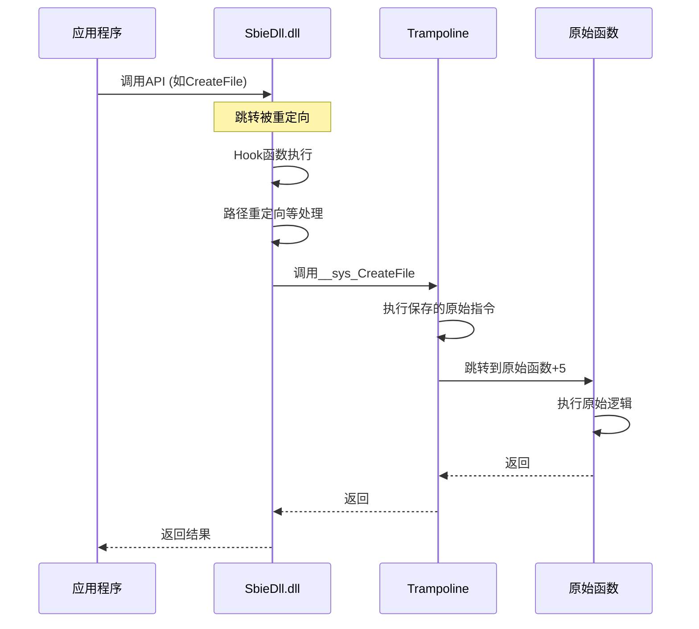

# Sandboxie Hook框架与系统调用拦截源码详解

## 概述

Sandboxie 使用多层Hook技术拦截系统调用和API函数，实现沙箱隔离。本文档详细分析Hook框架的实现原理。

## 核心文件

- **驱动层**: `Sandboxie/core/drv/syscall.c` - 系统调用拦截
- **DLL层**: `Sandboxie/core/dll/hook_tramp.c` - Trampoline生成
- **DLL层**: `Sandboxie/core/dll/dllhook.c` - DLL Hook框架

---

## 一、系统调用拦截 (驱动层)

### 1.1 系统调用表结构

#### SYSCALL_ENTRY 结构

```c
typedef struct _SYSCALL_ENTRY {
    LIST_ELEM list_elem;
    
    const UCHAR *name;              // 系统调用名称 (如 "CreateFile")
    ULONG syscall_index;            // 系统调用号
    
    void *ntos_func;                // 内核函数地址
    ULONG param_count;              // 参数个数
    
    // 处理函数指针
    P_Syscall_Handler1 handler1;   // 预处理
    P_Syscall_Handler2 handler2;   // 后处理
    P_Syscall_Handler3 handler3;   // 条件处理
    
} SYSCALL_ENTRY;
```

#### 处理函数类型

```c
// 类型1: 完全替换系统调用
typedef NTSTATUS (*P_Syscall_Handler1)(
    PROCESS *proc,
    SYSCALL_ENTRY *syscall_entry,
    ULONG_PTR *user_args
);

// 类型2: 后处理（在原始调用之后）
typedef NTSTATUS (*P_Syscall_Handler2)(
    PROCESS *proc,
    SYSCALL_ENTRY *syscall_entry,
    ULONG_PTR *user_args
);

// 类型3: 条件处理（决定是否调用原始函数）
typedef BOOLEAN (*P_Syscall_Handler3)(
    PROCESS *proc,
    SYSCALL_ENTRY *syscall_entry,
    ULONG_PTR *user_args
);
```

### 1.2 初始化系统调用表

#### Syscall_Init() 函数

```c
_FX BOOLEAN Syscall_Init(void)
{
    // 1. 初始化系统调用列表
    if (! Syscall_Init_List())
        return FALSE;

    // 2. 初始化系统调用表
    if (! Syscall_Init_Table())
        return FALSE;

    // 3. 初始化服务描述符表
    if (! Syscall_Init_ServiceData())
        return FALSE;

    // 4. 注册常用系统调用处理器
    if (! Syscall_Set1("DuplicateObject", Syscall_DuplicateHandle))
        return FALSE;

    if (Driver_OsVersion >= DRIVER_WINDOWS_VISTA) {
        if (!Syscall_Set1("GetNextProcess", Syscall_GetNextProcess))
            return FALSE;
        if (!Syscall_Set1("GetNextThread", Syscall_GetNextThread))
            return FALSE;
    }

    if (!Syscall_Set1("DeviceIoControlFile", Syscall_DeviceIoControlFile))
        return FALSE;

    // 5. 设置API处理器
    Api_SetFunction(API_QUERY_SYSCALLS, Syscall_Api_Query);
    Api_SetFunction(API_INVOKE_SYSCALL, Syscall_Api_Invoke);

    return TRUE;
}
```

#### Syscall_Init_List() - 构建系统调用列表

```c
static BOOLEAN Syscall_Init_List(void)
{
    UCHAR *code;
    ULONG index;
    const UCHAR *name;
    
    List_Init(&Syscall_List);
    
    // 1. 获取ntdll.dll基址
    HMODULE ntdll = GetModuleHandle(L"ntdll.dll");
    if (!ntdll)
        return FALSE;
    
    // 2. 遍历导出表，查找所有Nt*函数
    PIMAGE_EXPORT_DIRECTORY exports = ...;
    
    for (ULONG i = 0; i < exports->NumberOfNames; i++) {
        name = (const UCHAR *)((ULONG_PTR)ntdll + names[i]);
        
        // 只处理Nt*和Zw*函数
        if (name[0] != 'N' && name[0] != 'Z')
            continue;
        if (name[1] != 't' && name[1] != 'w')
            continue;
        
        // 3. 获取函数地址
        code = (UCHAR *)((ULONG_PTR)ntdll + functions[ordinals[i]]);
        
        // 4. 从函数代码中提取系统调用号
        index = Syscall_GetIndexFromNtdll(code);
        if (index == -1)
            continue;
        
        // 5. 创建SYSCALL_ENTRY
        SYSCALL_ENTRY *entry = Mem_Alloc(Driver_Pool, sizeof(SYSCALL_ENTRY));
        memzero(entry, sizeof(SYSCALL_ENTRY));
        
        entry->name = Mem_AllocString(name + 2);  // 跳过"Nt"前缀
        entry->syscall_index = index;
        
        // 6. 获取内核函数地址
        void *kernel_addr;
        ULONG param_count;
        if (Syscall_GetKernelAddr(index, &kernel_addr, &param_count)) {
            entry->ntos_func = kernel_addr;
            entry->param_count = param_count;
        }
        
        // 7. 加入列表
        List_Insert_After(&Syscall_List, NULL, entry);
    }
    
    return TRUE;
}
```

#### Syscall_GetIndexFromNtdll() - 提取系统调用号

```c
static ULONG Syscall_GetIndexFromNtdll(UCHAR *code)
{
    // Windows x64 系统调用存根格式:
    // mov r10, rcx
    // mov eax, <syscall_number>
    // syscall
    // ret
    
#ifdef _WIN64
    if (code[0] == 0x4C && code[1] == 0x8B && code[2] == 0xD1 &&  // mov r10, rcx
        code[3] == 0xB8) {                                         // mov eax, imm32
        return *(ULONG *)(code + 4);  // 返回系统调用号
    }
#else
    // Windows x86 系统调用存根格式:
    // mov eax, <syscall_number>
    // mov edx, 0x7FFE0300
    // call dword ptr [edx]
    // ret
    
    if (code[0] == 0xB8) {  // mov eax, imm32
        return *(ULONG *)(code + 1);
    }
#endif
    
    return -1;
}
```

### 1.3 注册系统调用处理器

#### Syscall_Set1() - 注册类型1处理器

```c
_FX BOOLEAN Syscall_Set1(const UCHAR *name, P_Syscall_Handler1 handler)
{
    SYSCALL_ENTRY *entry;
    
    // 1. 查找系统调用
    entry = List_Head(&Syscall_List);
    while (entry) {
        if (_stricmp(entry->name, name) == 0)
            break;
        entry = List_Next(entry);
    }
    
    if (!entry) {
        Syscall_ErrorForAsciiName(name);
        return FALSE;
    }
    
    // 2. 设置处理器
    entry->handler1 = handler;
    
    return TRUE;
}
```

### 1.4 系统调用分发

#### Syscall_Invoke() - 系统调用入口

```c
NTSTATUS Syscall_Invoke(SYSCALL_ENTRY *entry, ULONG_PTR *user_args)
{
    PROCESS *proc;
    NTSTATUS status;
    
    // 1. 获取当前进程
    proc = Process_Find(PsGetCurrentProcessId(), NULL);
    if (!proc) {
        // 不是沙箱进程，直接调用原始函数
        return Syscall_InvokeOriginal(entry, user_args);
    }
    
    // 2. 调用类型3处理器（条件检查）
    if (entry->handler3) {
        BOOLEAN should_invoke = entry->handler3(proc, entry, user_args);
        if (!should_invoke)
            return STATUS_SUCCESS;
    }
    
    // 3. 调用类型1处理器（完全替换）
    if (entry->handler1) {
        status = entry->handler1(proc, entry, user_args);
        return status;
    }
    
    // 4. 调用原始系统调用
    status = Syscall_InvokeOriginal(entry, user_args);
    
    // 5. 调用类型2处理器（后处理）
    if (entry->handler2) {
        entry->handler2(proc, entry, user_args);
    }
    
    return status;
}
```

---

## 二、用户态Hook框架 (DLL层)

### 2.1 Trampoline技术

Trampoline是一小段跳转代码，用于保存原始函数的前几条指令。

#### HOOK_TRAMP 结构

```c
typedef struct _HOOK_TRAMP {
    UCHAR code[64];         // Trampoline代码
    ULONG code_len;         // 代码长度
    void *target_func;      // 目标函数地址
    void *hook_func;        // Hook函数地址
} HOOK_TRAMP;
```

#### Hook原理图

```
原始函数:
+------------------+
| mov edi, edi     |  ← 被覆盖
| push ebp         |  ← 被覆盖
| mov ebp, esp     |  ← 被覆盖
| ...              |
+------------------+

Hook后:
+------------------+
| jmp hook_func    |  ← 5字节跳转指令
| ...              |
+------------------+

Trampoline:
+------------------+
| mov edi, edi     |  ← 保存的原始指令
| push ebp         |
| mov ebp, esp     |
| jmp original+5   |  ← 跳回原始函数
+------------------+
```

### 2.2 Trampoline生成

#### Hook_Tramp_Build() 函数

```c
void *Hook_Tramp_Build(void *SourceFunc, void *HookFunc)
{
    HOOK_TRAMP *tramp;
    ULONG byte_count;
    BOOLEAN is64 = FALSE;
    
#ifdef _WIN64
    is64 = TRUE;
#endif
    
    // 1. 计算需要复制的字节数（至少5字节用于jmp指令）
    if (!Hook_Tramp_CountBytes(SourceFunc, &byte_count, is64, FALSE))
        return NULL;
    
    // 2. 分配Trampoline内存
    tramp = Hook_Tramp_Alloc(sizeof(HOOK_TRAMP));
    if (!tramp)
        return NULL;
    
    // 3. 复制原始指令到Trampoline
    if (!Hook_Tramp_Copy(tramp, SourceFunc, byte_count, is64, FALSE)) {
        Hook_Tramp_Free(tramp);
        return NULL;
    }
    
    // 4. 在Trampoline末尾添加跳转指令（跳回原始函数）
    UCHAR *tramp_end = tramp->code + byte_count;
    
#ifdef _WIN64
    // x64: jmp [rip+0]; dq target_address
    tramp_end[0] = 0xFF;  // jmp
    tramp_end[1] = 0x25;  // [rip+0]
    *(ULONG *)(tramp_end + 2) = 0;
    *(ULONG_PTR *)(tramp_end + 6) = (ULONG_PTR)SourceFunc + byte_count;
    tramp->code_len = byte_count + 14;
#else
    // x86: jmp target_address
    tramp_end[0] = 0xE9;  // jmp
    *(ULONG *)(tramp_end + 1) = 
        (ULONG)((ULONG_PTR)SourceFunc + byte_count - (ULONG_PTR)tramp_end - 5);
    tramp->code_len = byte_count + 5;
#endif
    
    // 5. 设置内存为可执行
    ULONG old_protect;
    VirtualProtect(tramp->code, tramp->code_len, 
                   PAGE_EXECUTE_READ, &old_protect);
    
    return tramp->code;
}
```

#### Hook_Tramp_CountBytes() - 计算指令长度

```c
static BOOLEAN Hook_Tramp_CountBytes(
    void *SysProc, 
    ULONG *ByteCount, 
    BOOLEAN is64, 
    BOOLEAN probe)
{
    UCHAR *addr = (UCHAR *)SysProc;
    ULONG needlen = (is64 ? 12 : 5);  // x64需要12字节，x86需要5字节
    ULONG copylen = 0;

    // 计算至少needlen字节的完整指令
    while (copylen < needlen) {
        HOOK_INST inst;
        
        // 分析指令
        BOOLEAN ok = Hook_Analyze(addr, probe, is64, &inst);
        if (!ok)
            return FALSE;
        
        // 检查是否是相对跳转指令
        if (inst.op1 == 0xFF && inst.op2 == 0x25) {
            // jmp [rip+offset] - 不能复制
            return FALSE;
        }
        
        if (inst.op1 == 0xE8 || inst.op1 == 0xE9) {
            // call/jmp rel32 - 需要重定位
            return FALSE;
        }
        
        copylen += inst.len;
        addr += inst.len;
    }

    *ByteCount = copylen;
    return TRUE;
}
```

#### Hook_Analyze() - 指令分析

```c
BOOLEAN Hook_Analyze(
    UCHAR *code, 
    BOOLEAN probe, 
    BOOLEAN is64, 
    HOOK_INST *inst)
{
    UCHAR *ptr = code;
    ULONG len = 0;
    
    // 1. 处理前缀
    while (*ptr == 0x66 || *ptr == 0x67 ||  // 操作数/地址大小前缀
           *ptr == 0xF0 || *ptr == 0xF2 || *ptr == 0xF3 ||  // LOCK/REPNE/REP
           (*ptr >= 0x40 && *ptr <= 0x4F)) {  // REX前缀 (x64)
        ptr++;
        len++;
    }
    
    // 2. 解析操作码
    inst->op1 = *ptr++;
    len++;
    
    // 3. 处理双字节操作码
    if (inst->op1 == 0x0F) {
        inst->op2 = *ptr++;
        len++;
    } else {
        inst->op2 = 0;
    }
    
    // 4. 解析ModR/M字节
    if (Hook_NeedsModRM(inst->op1, inst->op2)) {
        UCHAR modrm = *ptr++;
        len++;
        
        UCHAR mod = (modrm >> 6) & 3;
        UCHAR rm = modrm & 7;
        
        // 5. 处理SIB字节
        if (mod != 3 && rm == 4) {
            ptr++;  // SIB
            len++;
        }
        
        // 6. 处理位移
        if (mod == 1) {
            ptr++;  // disp8
            len++;
        } else if (mod == 2 || (mod == 0 && rm == 5)) {
            ptr += 4;  // disp32
            len += 4;
        }
    }
    
    // 7. 处理立即数
    ULONG imm_size = Hook_GetImmSize(inst->op1, inst->op2);
    ptr += imm_size;
    len += imm_size;
    
    inst->len = len;
    return TRUE;
}
```

### 2.3 安装Hook

#### Hook_Install() 函数

```c
BOOLEAN Hook_Install(
    void *SourceFunc,
    void *HookFunc,
    void **OutTrampoline)
{
    UCHAR *target = (UCHAR *)SourceFunc;
    ULONG old_protect;
    
    // 1. 构建Trampoline
    void *trampoline = Hook_Tramp_Build(SourceFunc, HookFunc);
    if (!trampoline)
        return FALSE;
    
    // 2. 修改目标函数内存保护
    if (!VirtualProtect(target, 32, PAGE_EXECUTE_READWRITE, &old_protect))
        return FALSE;
    
    // 3. 写入跳转指令
#ifdef _WIN64
    // x64: jmp [rip+0]; dq hook_address
    target[0] = 0xFF;  // jmp
    target[1] = 0x25;  // [rip+0]
    *(ULONG *)(target + 2) = 0;
    *(ULONG_PTR *)(target + 6) = (ULONG_PTR)HookFunc;
    
    // 填充剩余字节为NOP
    for (int i = 14; i < 32; i++)
        target[i] = 0x90;  // nop
#else
    // x86: jmp hook_address
    target[0] = 0xE9;  // jmp
    *(ULONG *)(target + 1) = 
        (ULONG)((ULONG_PTR)HookFunc - (ULONG_PTR)target - 5);
    
    // 填充剩余字节为NOP
    for (int i = 5; i < 32; i++)
        target[i] = 0x90;  // nop
#endif
    
    // 4. 刷新指令缓存
    FlushInstructionCache(GetCurrentProcess(), target, 32);
    
    // 5. 恢复内存保护
    VirtualProtect(target, 32, old_protect, &old_protect);
    
    // 6. 返回Trampoline地址
    *OutTrampoline = trampoline;
    
    return TRUE;
}
```

### 2.4 Hook宏定义

#### SBIEDLL_HOOK 宏

```c
#define SBIEDLL_HOOK(func) \
    do { \
        __sys_##func = NULL; \
        if (!Hook_Install( \
                GetProcAddress(Dll_Ntdll, #func), \
                func, \
                (void **)&__sys_##func)) { \
            SbieApi_Log(2305, L#func); \
            return FALSE; \
        } \
    } while (0)
```

使用示例：

```c
// 声明函数指针
typedef NTSTATUS (*P_NtCreateFile)(...);
P_NtCreateFile __sys_NtCreateFile = NULL;

// Hook函数
NTSTATUS File_NtCreateFile(...)
{
    // 自定义逻辑
    // ...
    
    // 调用原始函数
    return __sys_NtCreateFile(...);
}

// 安装Hook
SBIEDLL_HOOK(NtCreateFile);
```

---

## 三、Hook初始化流程

### 3.1 DLL初始化

#### SbieDll_HookInit() 函数

```c
BOOLEAN SbieDll_HookInit(void)
{
    // 1. 初始化Hook框架
    if (!Hook_Init())
        return FALSE;
    
    // 2. Hook文件系统API
    if (!File_Init())
        return FALSE;
    
    // 3. Hook注册表API
    if (!Key_Init())
        return FALSE;
    
    // 4. Hook进程/线程API
    if (!Proc_Init())
        return FALSE;
    
    // 5. Hook IPC API
    if (!Ipc_Init())
        return FALSE;
    
    // 6. Hook网络API
    if (!Net_Init())
        return FALSE;
    
    // 7. Hook GUI API
    if (!Gui_Init())
        return FALSE;
    
    // 8. Hook COM API
    if (!Com_Init())
        return FALSE;
    
    return TRUE;
}
```

### 3.2 Hook时序图



---

## 四、高级Hook技术

### 4.1 IAT Hook

Import Address Table (IAT) Hook用于拦截导入函数。

```c
BOOLEAN Hook_IAT(
    HMODULE module,
    const char *import_dll,
    const char *func_name,
    void *hook_func,
    void **out_original)
{
    // 1. 获取PE头
    PIMAGE_DOS_HEADER dos_header = (PIMAGE_DOS_HEADER)module;
    PIMAGE_NT_HEADERS nt_headers = 
        (PIMAGE_NT_HEADERS)((ULONG_PTR)module + dos_header->e_lfanew);
    
    // 2. 获取导入表
    PIMAGE_IMPORT_DESCRIPTOR import_desc = 
        (PIMAGE_IMPORT_DESCRIPTOR)((ULONG_PTR)module + 
        nt_headers->OptionalHeader.DataDirectory[IMAGE_DIRECTORY_ENTRY_IMPORT].VirtualAddress);
    
    // 3. 遍历导入DLL
    while (import_desc->Name) {
        const char *dll_name = (const char *)((ULONG_PTR)module + import_desc->Name);
        
        if (_stricmp(dll_name, import_dll) == 0) {
            // 4. 遍历导入函数
            PIMAGE_THUNK_DATA thunk = 
                (PIMAGE_THUNK_DATA)((ULONG_PTR)module + import_desc->FirstThunk);
            PIMAGE_THUNK_DATA orig_thunk = 
                (PIMAGE_THUNK_DATA)((ULONG_PTR)module + import_desc->OriginalFirstThunk);
            
            while (thunk->u1.Function) {
                if (!IMAGE_SNAP_BY_ORDINAL(orig_thunk->u1.Ordinal)) {
                    PIMAGE_IMPORT_BY_NAME import_name = 
                        (PIMAGE_IMPORT_BY_NAME)((ULONG_PTR)module + orig_thunk->u1.AddressOfData);
                    
                    if (strcmp((const char *)import_name->Name, func_name) == 0) {
                        // 5. 修改IAT条目
                        ULONG old_protect;
                        VirtualProtect(&thunk->u1.Function, sizeof(ULONG_PTR), 
                                       PAGE_READWRITE, &old_protect);
                        
                        *out_original = (void *)thunk->u1.Function;
                        thunk->u1.Function = (ULONG_PTR)hook_func;
                        
                        VirtualProtect(&thunk->u1.Function, sizeof(ULONG_PTR), 
                                       old_protect, &old_protect);
                        
                        return TRUE;
                    }
                }
                
                thunk++;
                orig_thunk++;
            }
        }
        
        import_desc++;
    }
    
    return FALSE;
}
```

### 4.2 Inline Hook检测与防护

```c
BOOLEAN Hook_Verify(void *func)
{
    UCHAR *code = (UCHAR *)func;
    
    // 检查是否被Hook（检测jmp指令）
#ifdef _WIN64
    if (code[0] == 0xFF && code[1] == 0x25) {
        // jmp [rip+offset]
        return FALSE;  // 已被Hook
    }
#else
    if (code[0] == 0xE9) {
        // jmp rel32
        return FALSE;  // 已被Hook
    }
#endif
    
    return TRUE;  // 未被Hook
}
```

---

## 五、调试技巧

### 5.1 查看Hook状态

```c
void Hook_DumpStatus(void)
{
    DbgPrint("=== Sandboxie Hook Status ===\n");
    
    SYSCALL_ENTRY *entry = List_Head(&Syscall_List);
    while (entry) {
        if (entry->handler1 || entry->handler2 || entry->handler3) {
            DbgPrint("Hooked: %s (Index: %d)\n", 
                     entry->name, entry->syscall_index);
        }
        entry = List_Next(entry);
    }
}
```

### 5.2 WinDbg调试

```
// 查看系统调用表
dt nt!KeServiceDescriptorTable

// 查看特定系统调用
u nt!NtCreateFile

// 查看Trampoline
u <trampoline_address>

// 设置断点
bp SbieDll!File_NtCreateFile
bp SbieDrv!Syscall_Invoke
```

---

## 总结

Sandboxie Hook框架通过以下技术实现：

1. **系统调用拦截** - 驱动层拦截内核系统调用
2. **Trampoline技术** - 保存原始指令，实现透明Hook
3. **多层Hook** - 驱动层+DLL层双重拦截
4. **指令分析** - 精确解析x86/x64指令
5. **IAT Hook** - 拦截导入函数

这确保了：
- ✅ 完全拦截所有API调用
- ✅ 透明重定向
- ✅ 最小性能开销
- ✅ 兼容性好
