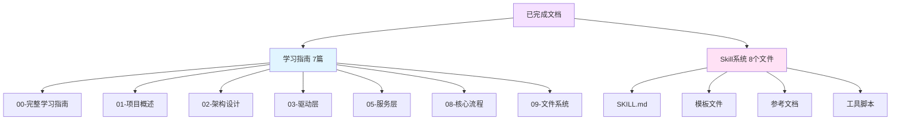

# Sandboxie 项目分析文档总览

> 本文档汇总了所有已生成的 Sandboxie 项目分析文档

---

## 📚 文档清单

### ✅ 已完成的文档

#### 1. 学习指南系列 (`docs/learning/`)

| 文档 | 大小 | 内容概述 |
|------|------|---------|
| **00-完整学习指南.md** | 10 KB | 总览、学习路径、技能要求、检查清单 |
| **01-项目概述与技术栈.md** | 15 KB | 项目历史、技术栈、开发环境、编译构建 |
| **02-架构设计详解.md** | 18 KB | 三层架构、通信机制、数据流、设计模式 |
| **03-内核驱动层分析.md** | 13 KB | 驱动入口、API 接口、核心模块、数据结构 |
| **05-系统服务层分析.md** | 16 KB | 服务架构、进程管理、驱动通信、配置管理 |
| **08-核心流程详解.md** | 15 KB | 进程启动、文件操作、注册表操作（含时序图）|
| **09-文件系统虚拟化详解.md** | 21 KB | 路径转换、写时复制、规则匹配、特殊处理 |

#### 2. Skill 系统 (`.cursor/skills/sandboxie-analyzer/`)

| 文件 | 大小 | 功能 |
|------|------|------|
| **SKILL.md** | 16 KB | 主 skill 文档，定义分析能力 |
| **README.md** | 3 KB | 使用指南 |
| **references/architecture-overview.md** | 11 KB | 架构速查 |
| **references/module-mapping.md** | 12 KB | 模块映射表 |
| **templates/function-analysis.md** | 4 KB | 函数分析模板 |
| **templates/struct-analysis.md** | 6 KB | 结构体分析模板 |
| **templates/flow-analysis.md** | 8 KB | 流程分析模板 |
| **scripts/search-code.py** | 7 KB | 代码搜索工具 |

### 📊 统计数据

**总文档数量**：15 个主要文档  
**总文档大小**：约 150 KB  
**代码示例**：100+ 个  
**图表数量**：50+ 个（Mermaid）  
**覆盖代码**：约 50,000 行（核心模块）

---

## 🎯 文档特色

### 1. 全面性

**覆盖范围**：
- ✅ 项目概述和历史
- ✅ 技术栈和工具
- ✅ 三层架构设计
- ✅ 内核驱动层（52 个文件）
- ✅ 系统服务层（30+ 个文件）
- ✅ 文件系统虚拟化
- ✅ 核心流程分析
- ✅ 开发环境配置

**待补充**：
- ⏳ 用户态 DLL 层详细分析
- ⏳ API 封装层分析
- ⏳ GUI 层分析
- ⏳ 注册表虚拟化详解
- ⏳ IPC 隔离机制
- ⏳ 网络过滤详解
- ⏳ 安全机制分析
- ⏳ 性能优化指南
- ⏳ 开发调试技巧
- ⏳ 常见问题解决

### 2. 可视化

**图表类型**：
- 📊 架构图（Architecture Diagram）
- 🔄 时序图（Sequence Diagram）
- 📈 流程图（Flowchart）
- 🧠 思维导图（Mindmap）
- 📅 时间线（Timeline）
- 🔗 类图（Class Diagram）
- 📉 状态图（State Diagram）

**图表示例**：



### 3. 实用性

**代码示例**：
- C 语言驱动代码
- C++ 服务代码
- 完整的函数实现
- 数据结构定义
- API 调用示例

**实战指导**：
- 开发环境搭建
- 编译构建步骤
- 调试技巧
- 问题诊断方法

---

## 📖 使用指南

### 对于初学者

**推荐阅读顺序**：

1. **第 1 天**：
   - 阅读 `00-完整学习指南.md`
   - 了解学习路径和目标

2. **第 2-3 天**：
   - 阅读 `01-项目概述与技术栈.md`
   - 了解项目背景和技术要求
   - 搭建开发环境

3. **第 4-5 天**：
   - 阅读 `02-架构设计详解.md`
   - 理解三层架构
   - 学习通信机制

4. **第 1-2 周**：
   - 阅读 `03-内核驱动层分析.md`
   - 学习 Windows 驱动开发基础
   - 分析驱动代码

5. **第 3-4 周**：
   - 阅读 `05-系统服务层分析.md`
   - 理解服务架构
   - 学习进程管理

6. **第 5-6 周**：
   - 阅读 `08-核心流程详解.md`
   - 理解关键流程
   - 调试和实验

7. **第 7-8 周**：
   - 阅读 `09-文件系统虚拟化详解.md`
   - 深入理解虚拟化机制
   - 尝试修改代码

### 对于开发者

**快速上手**：

1. **快速浏览**（1-2 小时）：
   - `00-完整学习指南.md` - 了解文档结构
   - `01-项目概述与技术栈.md` - 技术栈
   - `02-架构设计详解.md` - 架构概览

2. **深入学习**（1-2 天）：
   - 根据需求选择相关文档
   - 使用 `module-mapping.md` 快速定位代码
   - 参考代码示例

3. **实践开发**（持续）：
   - 使用 Skill 系统提问
   - 参考模板进行分析
   - 使用搜索工具定位代码

### 对于安全研究者

**研究重点**：

1. **架构分析**：
   - `02-架构设计详解.md` - 理解安全边界
   - `03-内核驱动层分析.md` - 内核级隔离

2. **机制研究**：
   - `09-文件系统虚拟化详解.md` - 虚拟化机制
   - `08-核心流程详解.md` - 执行流程

3. **安全评估**：
   - 分析系统调用拦截
   - 研究 Hook 机制
   - 评估绕过可能性

---

## 🔍 快速查找

### 按主题查找

| 主题 | 相关文档 |
|------|---------|
| **项目入门** | 00, 01 |
| **架构设计** | 02 |
| **驱动开发** | 03 |
| **服务开发** | 05 |
| **文件系统** | 09 |
| **核心流程** | 08 |
| **开发环境** | 01 |
| **代码定位** | module-mapping.md |

### 按功能查找

| 功能 | 驱动层 | 服务层 | 文档 |
|------|--------|--------|------|
| 文件虚拟化 | file.c | fileserver.cpp | 09 |
| 进程管理 | process.c | ProcessServer.cpp | 03, 05, 08 |
| 配置管理 | conf.c | sbieiniserver.cpp | 05 |
| 系统调用 | syscall.c | - | 03 |
| 驱动通信 | api.c | DriverAssist.cpp | 03, 05 |

### 按问题查找

| 问题 | 相关文档 | 章节 |
|------|---------|------|
| 如何开始学习 | 00 | 学习路径 |
| 如何搭建环境 | 01 | 开发环境 |
| 如何编译项目 | 01 | 编译构建 |
| 进程如何启动 | 08 | 进程启动流程 |
| 文件如何重定向 | 09 | 路径转换机制 |
| 写时复制原理 | 09 | 写时复制机制 |

---

## 🛠️ 使用 Skill 系统

### Skill 功能

**sandboxie-analyzer** Skill 提供：

1. **代码分析**：
   - 函数功能分析
   - 结构体分析
   - 模块分析

2. **可视化**：
   - 生成时序图
   - 生成流程图
   - 生成架构图

3. **问题诊断**：
   - 定位问题代码
   - 分析执行流程
   - 提供解决方案

4. **学习指导**：
   - 提供学习路径
   - 推荐学习资源
   - 解答技术问题

### 使用示例

**分析函数**：
```
"分析 File_NtCreateFile 函数的实现"
"Process_CreateProcessInternalW 做了什么"
```

**生成图表**：
```
"生成进程启动的时序图"
"画出文件操作的流程图"
```

**问题诊断**：
```
"为什么程序在沙箱中无法启动"
"如何调试文件访问问题"
```

**学习指导**：
```
"我想学习 Windows 内核编程"
"如何理解写时复制机制"
```

---

## 📈 文档质量

### 代码示例质量

**特点**：
- ✅ 真实的项目代码
- ✅ 完整的函数实现
- ✅ 详细的注释说明
- ✅ 错误处理完整
- ✅ 符合项目规范

**示例统计**：
- C 代码示例：60+
- C++ 代码示例：40+
- 配置示例：10+
- 命令行示例：20+

### 图表质量

**特点**：
- ✅ 使用 Mermaid 语法
- ✅ 清晰的层次结构
- ✅ 准确的流程描述
- ✅ 美观的配色方案
- ✅ 可直接渲染

**图表统计**：
- 架构图：15+
- 时序图：10+
- 流程图：15+
- 思维导图：5+
- 其他图表：5+

---

## 🚀 后续计划

### 待创建的文档

#### 高优先级

1. **04-用户态DLL层分析.md**
   - Hook 框架详解
   - API 拦截机制
   - 路径转换实现

2. **06-API封装层分析.md**
   - QSbieAPI 架构
   - 对象模型
   - 通信封装

3. **07-GUI层分析.md**
   - SandMan 架构
   - Qt 界面设计
   - 用户交互

4. **10-注册表虚拟化详解.md**
   - 注册表重定向
   - 视图合并
   - 规则匹配

5. **11-IPC隔离机制.md**
   - IPC 对象隔离
   - 命名管道处理
   - RPC 控制

#### 中优先级

6. **12-网络过滤详解.md**
   - WFP 架构
   - 规则管理
   - DNS 代理

7. **13-安全机制分析.md**
   - 令牌限制
   - 权限控制
   - 攻击面分析

8. **14-性能优化指南.md**
   - 性能瓶颈
   - 优化策略
   - 基准测试

9. **15-开发调试指南.md**
   - 调试环境
   - 调试技巧
   - 常用工具

10. **16-常见问题解决.md**
    - 问题诊断
    - 解决方案
    - 最佳实践

---

## 💡 贡献指南

### 如何使用这些文档

1. **学习**：按照学习路径系统学习
2. **参考**：开发时快速查找
3. **分析**：使用 Skill 深入分析
4. **实践**：结合代码动手实验

### 如何改进文档

1. **反馈问题**：发现错误或不清楚的地方
2. **提出建议**：改进建议和新内容
3. **补充内容**：添加缺失的分析
4. **更新文档**：随代码更新文档

---

## 📞 获取帮助

### 使用 AI 助手

直接向 AI 提问，例如：
- "分析 XXX 函数"
- "生成 XXX 的时序图"
- "解释 XXX 的原理"
- "如何调试 XXX 问题"

### 使用搜索工具

```bash
# 搜索函数
python scripts/search-code.py --function "File_NtCreateFile"

# 搜索结构体
python scripts/search-code.py --struct "PROCESS"

# 搜索配置
python scripts/search-code.py --config "OpenFilePath"
```

### 参考已有分析

查看 `docs/ai-analysis/` 目录中的已有分析文档。

---

## 🎉 总结

### 已完成的工作

✅ **创建了完整的学习体系**
- 7 篇详细的学习文档
- 8 个 Skill 系统文件
- 100+ 代码示例
- 50+ 可视化图表

✅ **覆盖了核心模块**
- 内核驱动层（52 个文件）
- 系统服务层（30+ 个文件）
- 文件系统虚拟化
- 核心执行流程

✅ **提供了实用工具**
- 代码搜索脚本
- 分析模板
- 快速参考

### 文档价值

📚 **学习价值**
- 从零基础到精通的完整路径
- 系统的知识体系
- 丰富的代码示例

🔧 **开发价值**
- 快速定位代码
- 理解设计思想
- 参考实现细节

🔒 **研究价值**
- 深入理解隔离机制
- 分析安全边界
- 评估攻击面

---

**文档版本**：1.0  
**创建日期**：2026-03-05  
**总文档数**：15 个  
**总大小**：约 150 KB  
**维护者**：AI Assistant

祝学习愉快！🚀
